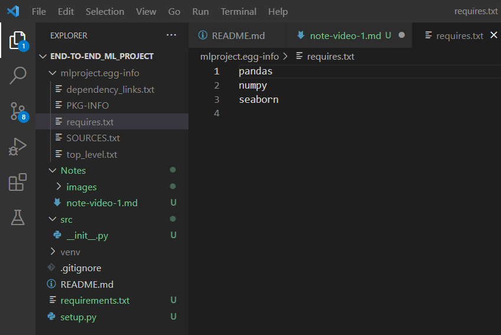

# [Tutorial 1- End To End ML Project With Deployment-Github And Code Set Up](https://youtu.be/Rv6UFGNmNZg)

## Creating an environment

We want to create an environment here itself instead of creating it seperately. 


We can use the following command to create an environment.

First update conda by running:

```
conda update -n base -c defaults conda
```

```
conda create -p venv python==3.8 -y
```

Our environment name will be __venv__ and the entire project will be developed using Python version 3.8 and __-y__ denotes that it will by give yes to questions asking for download permission.

If error in using conda commands like _conda is not recognized_ in VS code then give path of conda to environment variables - [check this video for reference](https://youtu.be/wuQbZbLIaEo).

When the above code executes we get the following note:

```
# To activate this environment, use
#
#     $ conda activate D:\Github\jeswingeorge\End-to-end_ML_project\venv
#
# To deactivate an active environment, use
#
#     $ conda deactivate
```

`conda acativate venv` doesnt work as the venv environment was created for this project and for this folder. By default conda's environments are created in the default __envs__ library/folder.

The activated terminal:


[Discussing using Git commands](https://youtu.be/Rv6UFGNmNZg?t=768)

Now you can add __.gitignore__ file, here from the github page and you can choose the language you are working on and you can by default get some of the extensions which you want to ignore.

## Creating a setup.py file

Create two files: __setup.py__ and __requirements.txt__.  

__setup.py__ is responsible for creating my machine learning application as a package and that can be installed also.

The setup.py is a Python script typically included with Python-written libraries or apps. Its objective is to ensure that the program is installed correctly. With the aid of pip , we can use the setup.py to install any module without having to call setup.py directly. The setup.py is a standard Python file.

##### Reference:
1. [Official docs - Writing the Setup Script](https://docs.python.org/3/distutils/setupscript.html)
2. [What is setup.py?](https://www.educative.io/answers/what-is-setuppy)

```
from setuptools import find_packages, setup

setup(
name = "mlproject",
version = 0.0.1,
author = "Jeswin",
author_email="georgejeswin22@gmail.com",
packages=find_packages()
install_requires=['pandas', 'numpy', 'seaborn']  # first the availability of these packages checked if not available then install

)
```

__find_packages :__ This will automatically find out all packages which are available in the entire machine learning applicaton/directory we have created.

In __setup.py__ we can find out how many packages are there. We create a folder __src__ (source) and inside it create a file called __ __init.py__ __.

Now when __setup.py__ is run the function `find_packages()` will go and check how many of the folders have `__init__.py`.  So the __src__ folder will be considered as a package itself and we can import it like other packages.

Entire project development will be done inside __src__ folder.

In case of scenarios having many packages say 100s, we can use a function which calls the __requirements.txt__ file: `get_requirements('requirement.txt')`


Now we can directly install the __setup.py__ or whenever we want to install the packages in __requirements.txt__ at that point of time the __setup.py__ file should also run to build the packages so to speciifically do that we can write __-e .__ at the end which will automatically trigger  __setup.py__ file.

But __-e .__  must not be there in the requirements list so we have to remove that. Check the updated __setup.py__ file.

```
HYPEN_E_DOT =   "-e ."

def get_requirements(file_path:str)->List[str]:  # function takes string as input and returns a list of strings
    '''
    This function will return the list of packages which are requirements
    '''
    requirements = []
    with open(file_path) as file_obj:
        requirements = file_obj.readlines()
        requirements = [req.replace("\n", "")  for req in requirements]

        if HYPEN_E_DOT in requirements:
            requirements.remove(HYPEN_E_DOT)


    return(requirements)
```

Now observe that our __src__ folder has only __ __init.py__ __ file. Now in the terminal just type `pip install -r requirements.txt`

After succefully running the code - `pip install -r requirements.txt`, we can see a new folder being created __mlproject.egg-info__.
It has different files which can help us to understand or give deatils about the package.  
__mlproject.egg-info__ tells the package is being installed and we can use this package anywhere if we deploy it in PyPi.


__SOURCES.txt__ tells which all things have been automatically considered and we can it has considred __src/__init__.py__.  

On checking __requires.txt__ observe that __-e .__ has gone.



__PKF-INFO__ has the info we gave in __setup.py__.

Now our basic setup is done using __setup.py__ and __requirements.txt__. Now inside our __src__ folder we will keep on adding folders and files relating to this specific project.
